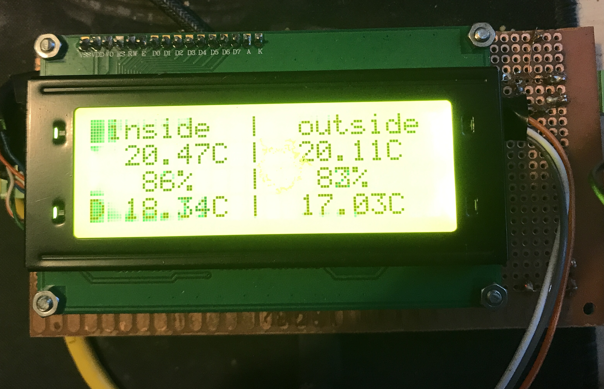
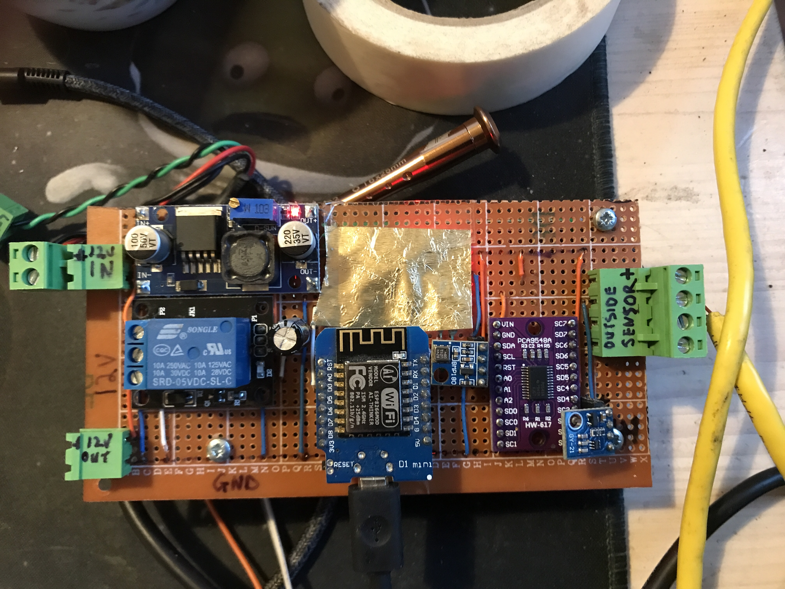
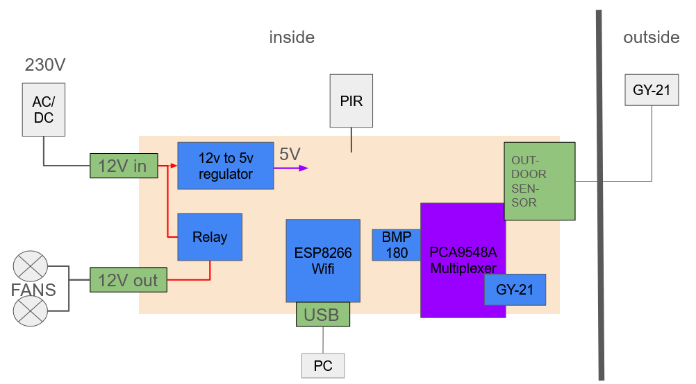
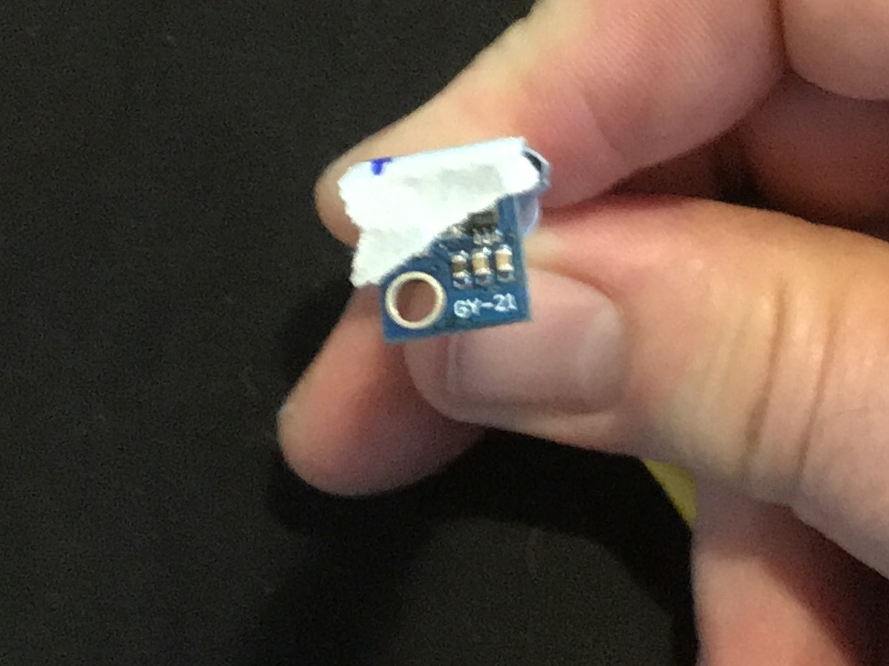
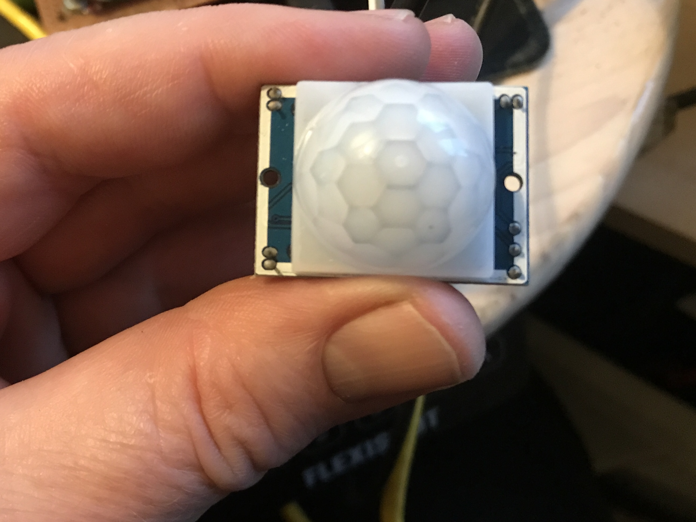

# dew_point_regulated_ventilation
Ventilation that only kicks in if the outside air is dry enough to avoid condensation inside

Inspired by [Taupunktlüfter https://github.com/MakeMagazinDE/Taupunktluefter/tree/main] the basic idea is to avoid ventilation while its to humid outside.

In Ireland we have cold clear day's frequently followed up by warn rainy day's especially in the winter. For an outdoor building with open ventialation can then turin into a humidity collector. The weather changes fast enough that even cardboard can end up covered in condensation. The consequence is typically mold. 

The unit consists of:

* ESP8226 for wifi and brains
* 2x GY-21 humidity and temperature sensors
* 1x BMP180 air pressure sensor (just for fun)
* 1x PIR motion sensor (just for backlight control)
* 1x 20x4 LCD
* 1x PCA9548A multiplexor
* 1x SRD-05-VDC-SLC 5V controlled 10A 250VA relay (ony used for 12V)
* 1x 12V to 5V regulator
* breadboard
* various headers

Aside from switching two 12V fan's on and off the unit also:
* Displays inside temperature and humidy
* Displays outside tempreature and humidy
* Measures inside air presure for some reason
* Serve's data on a HTTP REST inteface
* Turns backlight on if PIR is triggered

## Compile it?
If you intend to compile it and load it onto a Generic ESP8266 you will need to figure out the libs and add the folowing header into source:

src/wifi_access.h
```
const char* ssid = "YOU_WIFI_NAME";
const char* password = "YOUR_PASSWORD";
```

## Some pics

Documentation at this project is scatchy. I basically lumped everything together on a breadboard that eventually became so flimsy that I had to transfer it to solderable breadboard.

### Front



### Back





The 12V circuit is only for the outdoor fans getting their power over the Relay. The Relay it self and everything else is run with 5V.
A LM7805 would be cheaper but uses heat to reduce the voltage complicating things. There is one 100uF capacitor to regulate the power fluctuations on the 5V rail.

The ESP8266 is the brains that connects to wifi at startup and then to the BMP180 and GY-21s across the PCA9548A I2C multiplexer. Forgot how the PIR is connected. The 20x4 LCD is via serial.


### Outdoor Sensor
Due to the bus in use we have limited wire lenght. 1m is already chancing it at full i2c speed. The i2c specs state to allow up to 10m at 100bout, never tried.




### Indoor PIR
Why not. Ment to hook this up to an internal LED light as well but never got to it.



### REST data
Sample rest data, unit was inside the house at the time:

```
{
  "temp_inside": 20.92,
  "hum_inside": 80.80,
  "dew_point_inside": 17.50,
  "temp_outside": 20.10,
  "hum_outside": 82.66,
  "dew_point_outside": 17.05,
  "ventilation": 0,
  "pirStat": 1,
  "wifiSignalStrength": -85,
  "pressure": 100342,
  "seaLevelPressure": 100343,
  "altitude": 82.25,
  "realAltitude": 96.36
}s
```

## How well does it work?

In Ireland the chances of having dry enough outside air is just not happening often enough. The building this unit is in was never designed to be dry in the firs place. When the unit broke down due to a failing GY-21 for 3 Month in the winter it did get VERY obvious that everything in the shed is doomed without the unit. Aside from metal rosting everything started growing mold and the smell of dempness started to inensify.

## What next?

At some stage I like to:
* put it into a box
* Properly collect and post process the data
* Use the PIR to switch on some light in the shed


## Refs

* pinout https://escapequotes.net/esp8266-wemos-d1-mini-pins-and-diagram/
* following ruffly https://github.com/MakeMagazinDE/Taupunktluefter/blob/main/Taupunkt_Lueftung.ino
* GY-HTU21 https://github.com/adafruit/Adafruit_HTU21DF_Library
* https://github.com/adafruit/DHT-sensor-library
